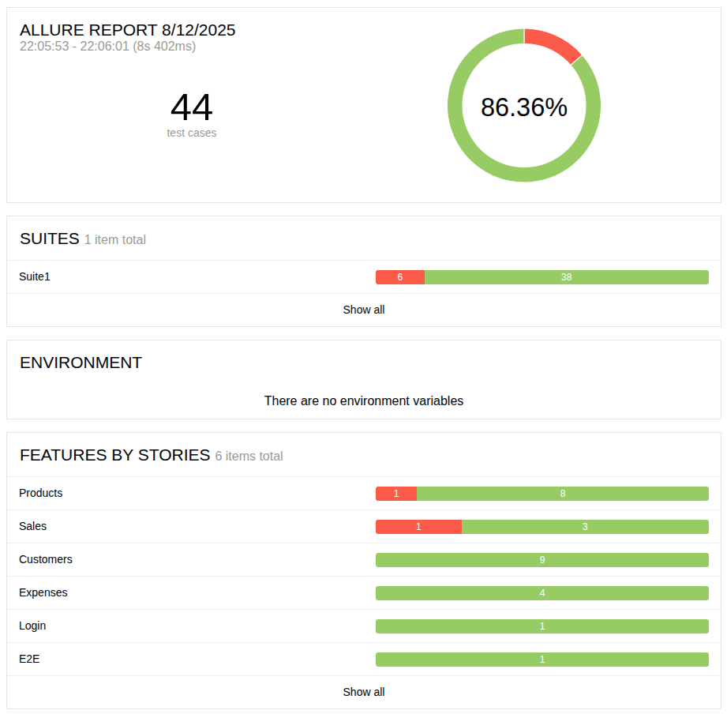

# ITI API Testing Project

---
layout: section
hideInToc: true
---

# Table of contents

::right::

<Toc />

---

# Introduction

<br />

## API

API (Application Programming Interface) is a set of rules that allows
different software components to communicate with each other.

## API Testing

API Testing focuses on validating the behavior, performance, and security
of backend APIs — the critical layer between frontend and database.

---
hideInToc: true
---

# Introduction (continued)

## Benefits of API Testing:

- Early Bug Detection
- Supports Automation and CI/CD
- Enhances Security
- Validates Core Business Logic

---

# Project overview

<br>

This project focuses on automating end-to-end API testing using Postman collections,
executing them with Newman, and building Java-based API tests using Rest-Assured

---
hideInToc: true
---

# Project overview (continued)

## The backend

**PocketBase** is an open-source backend solution that runs as a single executable file.

It provides an instant backend with:
- Built-in SQLite database
- Realtime APIs (REST & WebSocket)
- User authentication & file storage out of the box
- Web-based admin dashboard for managing data
- Extendable with custom Go code

On a local environment, it usually runs on `http://localhost:8090/api` as a REST API,
along with the dashboard on `http://localhost:8090/_`

---

# Project structure

<br>

The project is split into two smaller projects:
1. PocketBase
2. Java-based tests

---
title: PocketBase
level: 2
---

# Project structure: Pocketbase

<br>

PocketBase is used here as an open-source project via Go (a programming language)
and is in `pocketbase/` which contains:
- `go.mod` and `go.sum`: for dependency management.
- `main.go`: entry file for PocketBase.
- `migrations/*.go`: migration files used to create tables & insert sample data.
---
hideInToc: true
level: 2
---

# Project structure: Pocketbase (continued)

## Built-in tables

`_superusers`: a table storing admin information and can be used for authentication.

Example usage:

```http {all|1|3-|all}
POST http://localhost:8090/api/collections/_superusers/auth-with-password

{
  "identity": "...", // email goes here
  "password": "..."
}
```

---
hideInToc: true
class: text-[16px]
level: 2
---

# Project structure: Pocketbase (continued)

## Custom tables (through migrations)

- `customers`: stores customer information.

  Fields: name (required), phone (required, unique)

- `products`: tracks available products and inventory levels.

  Fields: name (required, unique), price (min 0.5), stock (min 0)

- `sales`: records sales transactions linking customers to purchased products.

  Fields: timestamp (required), customer (relation), product (relation), quantity (min 0.5)

- `expenses`: tracks business expenses.

  Fields: timestamp (required), description (required), amount (min 0.5), category (enum: rent, utilities, supplies, misc)

---
title: "Java-based tests"
level: 2
---

# Project structure: Java

## Tools/Dependencies

The project uses:
- `Maven`: a build tool for Java.
- `TestNG`: a test runner.
- `RestAssured`: for actual API testing.
- `Allure`: for test reporting.
- `Logback`: for logging.

---
hideInToc: true
level: 2
---

# Project structure: Java (continued)

## Directories/Files

- `testng.xml` and `src/test/resources/*.properties`: Config files.
- `src/test/java/iti/apitesting/*`: Test cases, helpers, etc.
  - `base/*` and `requests/*`: Base files to use in other packages.
  - `data/*`: For data-driven tests.
  - `listeners/*`: Listeners.
  - `tests/*`: Test cases.
    - `T01_Login.java`: Various authentication scenarios.
    - `T02_Customers.java -> T05_Expenses.java`: Testing CRUD functionality on custom tables.
    - `E2E.java`: End-to-end scenario.

---

# Usage

<br>
The PocketBase server can be started using the following commands from the project root:

```
cd pocketbase
go mod tidy
go run . serve
```

After it starts, the Java tests can be run using `mvn clean test` or by using your IDE's test runner.

> The `clean` subcommand cleans all logs, reports, and other generated files from the previous run.

For `newman`, use the following command:

`npx newman@latest run project.postman_collection.json`

> The collection file exported from postman should be included in the project files.

---

# Newman report

<div class="flex justify-center">
```
┌─────────────────────────┬──────────────────┬──────────────────┐
│                         │         executed │           failed │
├─────────────────────────┼──────────────────┼──────────────────┤
│              iterations │                1 │                0 │
├─────────────────────────┼──────────────────┼──────────────────┤
│                requests │               16 │                0 │
├─────────────────────────┼──────────────────┼──────────────────┤
│            test-scripts │               32 │                0 │
├─────────────────────────┼──────────────────┼──────────────────┤
│      prerequest-scripts │               21 │                0 │
├─────────────────────────┼──────────────────┼──────────────────┤
│              assertions │               26 │                0 │
├─────────────────────────┴──────────────────┴──────────────────┤
│ total run duration: 548ms                                     │
├───────────────────────────────────────────────────────────────┤
│ total data received: 2.79kB (approx)                          │
├───────────────────────────────────────────────────────────────┤
│ average response time: 11ms [min: 2ms, max: 59ms, s.d.: 19ms] │
└───────────────────────────────────────────────────────────────┘
```
</div>

---
layout: section
---

# Allure report

::right::



---

# Bugs found

<br>

1. When creating a product, providing a price of 0 or letters results in an error
message equal to "Cannot be blank." instead of a more accurate message.

2. When creating a sale, missing or wrong data don't have corresponding error messages.

---

# References

<br>

- PocketBase: https://pocketbase.io
- Project link: https://github.com/bdocoder/iti-api-testing-project

---
layout: statement
---

# Thanks